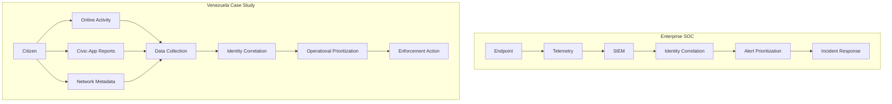

Title: When Telemetry Turns Predatory: A DevSecOps Look at Digital Repression in Venezuela
Date: 2026-08-25
Status: draft
Author: Oliver Rivas
Category: DevSecOps
Tags: devsecops, security, venezuela, censorship, threat-modeling, privacy, network-security, surveillance, data-minimization, dual-use, soc, detection-engineering, iam
Slug: telemetry-turns-predatory
Summary: Every SOC pipeline has a shadow version. Using Venezuela as a technically grounded case study, this piece maps the primitives security engineers build every day onto the surveillance systems those primitives can become.

# When Telemetry Turns Predatory: A DevSecOps Look at Digital Repression in Venezuela

Every Security Operations Center follows a familiar pattern: collect telemetry, correlate identities, prioritize signals, and trigger a response. Security engineers build these pipelines to defend infrastructure. The same architectural primitives, however, are inherently dual-use.

This article examines publicly documented events in Venezuela through the perspective of a DevSecOps engineer. It distinguishes between documented observations and engineering interpretation.

## A personal note

I have a personal stake in this analysis. I was born in Venezuela and left the Gran Caracas region at eighteen. I still have extended family there. I have also, in more than two decades since I left, been on the receiving end of the regime's information apparatus in ways that are not the subject of this piece. What I write below is not a policy essay - it is what a security engineer sees when he or she watches, over the course of many years, the slow convergence of a state and its telemetry. The technical patterns are familiar to anyone who has designed a SIEM, an identity provider, or an EDR pipeline. That familiarity is the point.

## Two pipelines, same primitives

Enterprise security tooling is not the problem. The problem is what the same collection, correlation, and prioritization patterns become when the customer is coercive power.

```text
          Enterprise SOC                Venezuela Case Study

  Endpoint                         Citizen
      |                                |
  Telemetry                        Online Activity
      |                            Civic-App Reports
      |                            Network Metadata
      |                                |
  SIEM                             Data Collection
      |                                |
  Identity Correlation             Identity Correlation
      |                                |
  Alert Prioritization             Operational Prioritization
      |                                |
  Incident Response                Enforcement Action
```



## Methodology

**Observation** refers to findings documented by credible public sources.

**Engineering interpretation** refers to analysis through the lens of cloud security, DevSecOps, and threat modeling.

## What the Public Evidence Shows

### Electronic Frontier Foundation (EFF)

**Observation**

EFF's *Unveiling Venezuela's Repression: Surveillance and Censorship Following July's Presidential Election* and *Unveiling Venezuela's Repression: A Legacy of State Surveillance and Control* document the evolution of VenApp after the 2024 presidential election and broader patterns of digital repression.

**Engineering Interpretation**

Viewed as a system, VenApp is a citizen-scale SIEM. The ingest layer is a mobile client; the events are user-attributed reports of "suspicious" behavior; the entity-resolution layer joins those reports against a national identity graph (cédula, phone number, device identifiers) - the same shape as an enterprise correlation against email, SSO subject, and device ID. Any engineer who has built a Splunk ingest pipeline, an Elastic detection rule, or a Sumo Logic content pack recognizes the pattern immediately. Normalization, field extraction, correlation, alert scoring, case creation - these are the same stages that turn raw logs into an IR ticket for a credential-stuffing attempt in an enterprise SOC. The difference is not architectural. The difference is who the tenant is, what the tenant treats as a "threat," and what happens at the response stage. In one pipeline the response is an account lockout and a support ticket. In the other, the response is physical.

### Freedom House

**Observation**

*Freedom on the Net 2025: Venezuela* documents expanded blocking of websites and communications platforms, reports of device inspections during Operación Tun-Tun, and arrests connected to online activity.

**Engineering Interpretation**

Operación Tun-Tun is what happens when endpoint detection and kinetic response merge into a single workflow. In an enterprise EDR context - Falcon, SentinelOne, Defender - an alert produces a ticket, a triage step, and at worst a device quarantine. The kinetic parallel exists (physical security escorting a compromised laptop off-site) but it is rare and tightly scoped. In the Venezuelan case, the same alert-to-response loop is compressed and applied at population scale: an online post, a device inspection at a checkpoint, and an arrest can function as stages of a single pipeline whose escalation path is physical. From a threat-modeling perspective, the transformation is not "surveillance was added." The transformation is that the response stage of an ordinary detection pipeline was rewired to enforcement rather than remediation.

The primitives were already in place.

### VE Sin Filtro

**Observation**

VE Sin Filtro, using OONI measurement methodologies, documents DNS manipulation, IP blocking, SNI filtering, interference with public DNS resolvers, and blocking of circumvention tools across multiple ISPs.

**Engineering Interpretation**

VE Sin Filtro's measurement work, built on OONI Probe, documents what interference actually looks like on the wire. Their 2025 election report identifies DNS manipulation on CANTV, Movistar, and Digitel - Venezuela's three dominant ISPs - including rewrites of A-record responses for independent media domains, SNI-based filtering that terminates TLS handshakes when the ClientHello advertises a censored hostname, and interference with public resolvers such as 1.1.1.1 and 8.8.8.8 that would otherwise route around the manipulation. Any enterprise security engineer recognizes these techniques. I have configured or debugged most of them from the defensive side: DNS Response Policy Zones and Cloudflare Gateway to block malware; TLS-aware proxies that read the SNI in ClientHello and drop connections to policy-blocked destinations; WAF and firewall ACLs that block by IP or CIDR. The mechanism is identical. Only the block list differs.

What VE Sin Filtro adds beyond policy reporting is a reproducible measurement methodology, which is what turns "the internet feels broken today" into an evidence-based finding that survives cross-checking.

## Every Security Capability Has an Abuse Case

| Security Capability | Enterprise Security Use | Potential Abuse |
|---|---|---|
| SIEM | Detect intrusions | Monitor political activity |
| DNS filtering | Block malware | Block independent media |
| Endpoint telemetry | Incident response | Citizen surveillance |
| Identity systems | Access control | Population tracking |
| Audit logs | Compliance and forensics | Behavioral profiling |
| Geolocation | Fraud detection | Movement monitoring |

## Security Engineering Lessons

The value of the Venezuelan case study for a security engineer is that it exposes an assumption embedded in most threat models: that the operator of the pipeline is the good actor. The moment that assumption becomes optional, every design decision changes. Three practices follow.

**1. Add a Weaponization section to every design review.**

Standard threat modeling frameworks - STRIDE, LINDDUN, PASTA - assume an external adversary attempting to compromise the system. They do not model the case where the legitimate operator of the system becomes the adversary. Add a fourth question to every design doc: *If an authoritarian tenant owned this pipeline, what would they do with it?* For every data flow you draw, write one sentence describing the weaponized use case. The exercise is uncomfortable, which is the point.

A minimal template lives at [github.com/rivassec/weaponization-threat-model](https://github.com/rivassec/weaponization-threat-model). It provides a one-page addendum to a standard STRIDE doc: for each data element, the authoritarian-tenant reading; for each retention decision, the subpoena-inversion reading; for each correlation-key choice, the population-tracking reading. Adopt it, fork it, or replace it. The specific artifact matters less than the commitment to run the exercise.

**2. Treat metadata as content.**

Encryption of message bodies is now table stakes. Metadata - who talked to whom, when, from where, on which device - is often left in plaintext, retained by default, and joined against identity systems. In the Venezuelan case, metadata is more than sufficient to prioritize enforcement. In your systems, metadata is more than sufficient to reconstruct behavior, relationships, and identity. Log the least metadata your product can function with, and retain it for the shortest window your compliance obligations allow. Ask this question the way you would ask about a security bug: not "is this useful to have?" but "is this dangerous to have?"

**3. Design as if governance will change.**

The tools you build outlive the leadership that scoped them. The privacy commitments made by a founding team do not bind the acquirer, the successor board, or the government that subpoenas the resulting system. Retention sunsets should be the default, not the exception. Owner-change reviews - what happens to this pipeline if the executive who scoped it leaves, if the company is acquired, or if a nation-state compels access - should be a scheduled part of your design cadence. This one I have practiced as a habit but not yet built into tooling; I raise it in design reviews and it lands or it doesn't, depending on the room. It should be built into the process instead.

I write "should be" because I have seen the shape of what happens when it isn't. Some years ago, I was part of a rollout at a large communications platform of a feature that required users to verify a phone number to keep certain account functions. I raised the abuse concern internally: in jurisdictions where pseudonymous accounts were the only safe way for activists to organize, a phone-verification requirement was going to be a state's dream - a real-name join key against every account operating under a handle. The escalation went to the appropriate teams. It was denied. Later, activists in one of the affected jurisdictions were arrested, and some did not survive their detention. I did not sleep well for a long time after that decision was made. I know correlation is not causation. I do not know whether the verification requirement contributed to those arrests, and I am not claiming that it did. I include this because the shape of the harm is what security engineers need to sit with, not because I claim to know its exact mechanism. It informs how I write every design review now.

## Caveats

Internet censorship measurement is inherently difficult. Network observations demonstrate that interference occurred, but attribution is often incomplete. Separating observations from engineering interpretation improves analytical rigor.

## References

[1] Laura Vidal. *Unveiling Venezuela's Repression: Surveillance and Censorship Following July's Presidential Election*. Electronic Frontier Foundation. September 16, 2024.
https://www.eff.org/deeplinks/2024/09/unveiling-venezuelas-repression-surveillance-and-censorship-following-julys

[2] Laura Vidal. *Unveiling Venezuela's Repression: A Legacy of State Surveillance and Control*. Electronic Frontier Foundation. September 18, 2024.
https://www.eff.org/deeplinks/2024/09/unveiling-venezuelas-repression-legacy-state-surveillance-and-control

[3] Freedom House. *Freedom on the Net 2025: Venezuela*.
https://freedomhouse.org/country/venezuela/freedom-net/2025

[4] VE Sin Filtro. *Reporte Redes de Control: Censura y represión digital en las elecciones presidenciales en Venezuela*. March 2025.
https://vesinfiltro.org/noticias/2025-03-12-reporte-elecciones-presidenciales/

[5] OONI Documentation.
https://ooni.org/

## Conclusion

The technology discussed here is not unique to Venezuela. It is the same telemetry, the same identity graphs, the same pipelines we build in every SOC on every continent. What changes is who operates them and against whom.

The question I want you to carry into your next design review is no longer only *is this design secure?* It is *who does this design protect, and who does it expose?*

I think about the systems I design now knowing that somewhere in the Gran Caracas region, my family is inside systems built with the same primitives. Every security engineer has a version of this thought waiting for them, whether or not they have already noticed it.
